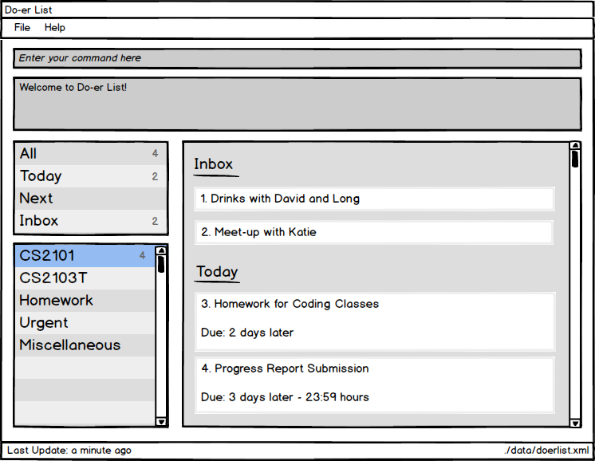

# Do-*er*List

 

* This is a desktop Todo list application. It has a GUI but most of the user interactions happen using 
  a CLI (Command Line Interface).
* It is a Java sample application intended to meet Jim's requirement. 
* It is **written in OOP fashion**. 
* Support for *Build Automation* using Gradle and for *Continuous Integration* using Travis CI.

  
#### Site Map
* [User Guide](docs/UserGuide.md) 
* [Developer Guide](docs/DeveloperGuide.md) 
* [Learning Outcomes](docs/LearningOutcomes.md) 
* [About Us](docs/AboutUs.md)
* [Contact Us](docs/ContactUs.md)

#### Acknowledgement
We used parts of the code from [AddressBook-level4](https://github.com/se-edu/addressbook-level4).

#### Dependency
Our project is dependent on the packages below:
* [Jackson](https://github.com/FasterXML/jackson)
* [Guava](https://github.com/google/guava)
* [TestFX](https://github.com/TestFX/TestFX)
* [JodaTime](http://www.joda.org/joda-time/index.html)

#### Licence : [MIT](LICENSE)
