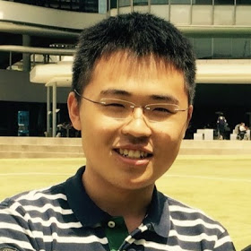

# About Us

We are [CS2103/T](http://www.comp.nus.edu.sg/~cs2103/AY1617S1/) team (**Wednesday 09 C4**) based in the [School of Computing, National University of Singapore](http://www.comp.nus.edu.sg).

## Project Team

#### [Xiao Pu](https://github.com/xpdavid)  
 

- Components in charge of: [UI](https://github.com/CS2103AUG2016-W09-C4/main/blob/master/docs/DeveloperGuide.md#ui-component)
- Aspects/tools in charge of: Testing, Integration, JavaFX
- Features implemented:
	- [List Tasks](https://github.com/CS2103AUG2016-W09-C4/main/blob/master/docs/UserGuide.md#listing-tasks-in-a-certain-category--list)
	- [Find Tasks](https://github.com/CS2103AUG2016-W09-C4/main/blob/master/docs/UserGuide.md#finding-all-tasks-containing-any-keyword-in-their-name--find)
	- [View Tasks](https://github.com/CS2103AUG2016-W09-C4/main/blob/master/docs/UserGuide.md#view-a-task--view)
	- [Delete Tasks](https://github.com/CS2103AUG2016-W09-C4/main/blob/master/docs/UserGuide.md#deleting-a-task--delete)
- Code written: [[functional code](https://github.com/CS2103AUG2016-W09-C4/main/blob/master/collated/main/A0147978E.md)][[test code](https://github.com/CS2103AUG2016-W09-C4/main/blob/master/collated/test/A0147978E.md)][[docs](https://github.com/CS2103AUG2016-W09-C4/main/blob/master/collated/docs/A0147978E.md)]
- Other major contributions
	- Design UI with [Yong Sheng](https://github.com/JasonScourge)
	- Set up Gradle, Travis, Coveralls and Codacy
	- Help other writing UI parts and GUI test cases for the features they implement.

-----

#### [Yong Sheng](https://github.com/JasonScourge)
 
Role: Developer  
Responsibilities: UI

-----

#### [Benedict Chan](https://github.com/Bendistocratic)
 
Role: Developer  
- Components in charge of: Storage
- Features implemented: 
	- Mark Task
	- Unmark Task
- Other major contributions
	- Doing the UserGuide.md and DeveloperGuide.md with [Yong Sheng](https://github.com/JasonScourge)

-----

#### [Vu Long](https://github.com/haiilong)
 
Role: Developer  
Responsibilities: Model

-----

## Roles and responsibilities

- Team lead: **Jason**
- Testing: **Benedict**
- Code quality: **Hai Long**
- Deliverables and deadlines: **Xiao Pu**
- Integration: **Jason**
- Scheduling and tracking: **Xiao Pu**
- Tool experts:
	- Git (SourceTree): **Xiao Pu**
	- JavaFX: **Jason**
	- Gradle: **Hai Long**
	- Travis: **Jason**
	- Eclipse: **Benedict**
