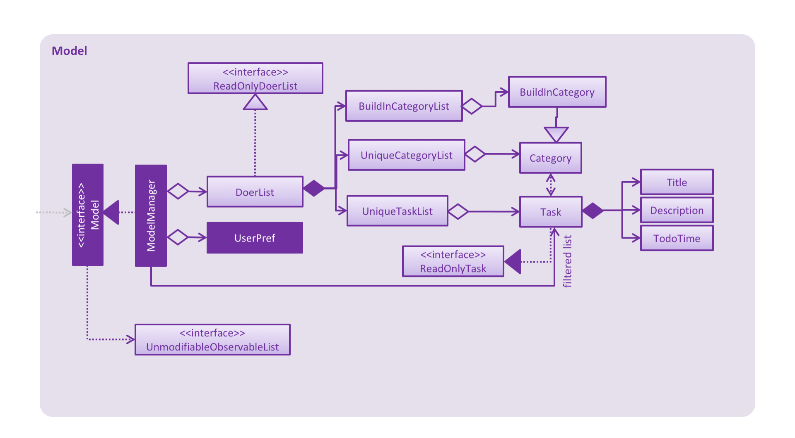

# Developer Guide 

* [Setting Up](#setting-up)
* [Design](#design)
* [Implementation](#implementation)
* [Testing](#testing)
* [Dev Ops](#dev-ops)
* [Appendix A: User Stories](#appendix-a--user-stories)
* [Appendix B: Use Cases](#appendix-b--use-cases)
* [Appendix C: Non Functional Requirements](#appendix-c--non-functional-requirements)
* [Appendix D: Glossary](#appendix-d--glossary)
* [Appendix E : Product Survey](#appendix-e-product-survey)

## Setting up

#### Prerequisites

1. **JDK `1.8.0_60`**  or later 

    > Having any Java 8 version is not enough.  
    This app will not work with earlier versions of Java 8.
    
2. **Eclipse** IDE
3. **e(fx)clipse** plugin for Eclipse (Do the steps 2 onwards given in
   [this page](http://www.eclipse.org/efxclipse/install.html#for-the-ambitious))
4. **Buildship Gradle Integration** plugin from the Eclipse Marketplace

#### Importing the project into Eclipse

0. Fork this repo, and clone the fork to your computer
1. Open Eclipse (Note: Ensure you have installed the **e(fx)clipse** and **buildship** plugins as given 
   in the prerequisites above)
2. Click `File` > `Import`
3. Click `Gradle` > `Gradle Project` > `Next` > `Next`
4. Click `Browse`, then locate the project's directory
5. Click `Finish`

  > * If you are asked whether to 'keep' or 'overwrite' config files, choose to 'keep'.
  > * Depending on your connection speed and server load, it can even take up to 30 minutes for the set up to finish
      (This is because Gradle downloads library files from servers during the project set up process)
  > * If Eclipse auto-changed any settings files during the import process, you can discard those changes.

## Design

### Architecture

 
The **_Architecture Diagram_** given above explains the high-level design of the App.
Given below is a quick overview of each component.

`Main` has only one class called [`MainApp`](../src/main/java/seedu/address/MainApp.java). It is responsible for,
* At app launch: Initializes the components in the correct sequence, and connect them up with each other.
* At shut down: Shuts down the components and invoke cleanup method where necessary.

[**`Commons`**](#common-classes) represents a collection of classes used by multiple other components.
Two of those classes play important roles at the architecture level.
* `EventsCentre` : This class (written using [Google's Event Bus library](https://github.com/google/guava/wiki/EventBusExplained))
  is used by components to communicate with other components using events (i.e. a form of _Event Driven_ design)
* `LogsCenter` : Used by many classes to write log messages to the App's log file.

The rest of the App consists four components.
* [**`UI`**](#ui-component) : The UI of tha App.
* [**`Logic`**](#logic-component) : The command executor.
* [**`Model`**](#model-component) : Holds the data of the App in-memory.
* [**`Storage`**](#storage-component) : Reads data from, and writes data to, the hard disk.

Each of the four components
* Defines its _API_ in an `interface` with the same name as the Component.
* Exposes its functionality using a `{Component Name}Manager` class.

For example, the `Logic` component (see the class diagram given below) defines it's API in the `Logic.java`
interface and exposes its functionality using the `LogicManager.java` class. 
 

The _Sequence Diagram_ below shows how the components interact for the scenario where the user issues the
command `delete 3`.

>Note how the `Model` simply raises a `AddressBookChangedEvent` when the Address Book data are changed,
 instead of asking the `Storage` to save the updates to the hard disk.

The diagram below shows how the `EventsCenter` reacts to that event, which eventually results in the updates
being saved to the hard disk and the status bar of the UI being updated to reflect the 'Last Updated' time.  

> Note how the event is propagated through the `EventsCenter` to the `Storage` and `UI` without `Model` having
  to be coupled to either of them. This is an example of how this Event Driven approach helps us reduce direct 
  coupling between components.

The sections below give more details of each component.

### UI component

 

**API** : [`Ui.java`](../src/main/java/seedu/address/ui/Ui.java)

The UI consists of a `MainWindow` that is made up of parts e.g.`CommandBox`, `ResultDisplay`, `PersonListPanel`,
`StatusBarFooter`, `BrowserPanel` etc. All these, including the `MainWindow`, inherit from the abstract `UiPart` class
and they can be loaded using the `UiPartLoader`.

The `UI` component uses JavaFx UI framework. The layout of these UI parts are defined in matching `.fxml` files
 that are in the `src/main/resources/view` folder. 
 For example, the layout of the [`MainWindow`](../src/main/java/seedu/address/ui/MainWindow.java) is specified in
 [`MainWindow.fxml`](../src/main/resources/view/MainWindow.fxml)

The `UI` component,
* Executes user commands using the `Logic` component.
* Binds itself to some data in the `Model` so that the UI can auto-update when data in the `Model` change.
* Responds to events raised from various parts of the App and updates the UI accordingly.

### Logic component

 

**API** : [`Logic.java`](../src/main/java/seedu/address/logic/Logic.java)

1. `Logic` uses the `Parser` class to parse the user command.
2. This results in a `Command` object which is executed by the `LogicManager`.
3. The command execution can affect the `Model` (e.g. adding a person) and/or raise events.
4. The result of the command execution is encapsulated as a `CommandResult` object which is passed back to the `Ui`.

Given below is the Sequence Diagram for interactions within the `Logic` component for the `execute("delete 1")`
 API call. 
 

### Model component

 

**API** : [`Model.java`](../src/main/java/seedu/address/model/Model.java)

The `Model`,
* stores a `UserPref` object that represents the user's preferences.
* stores the Address Book data.
* exposes a `UnmodifiableObservableList<ReadOnlyPerson>` that can be 'observed' e.g. the UI can be bound to this list
  so that the UI automatically updates when the data in the list change.
* does not depend on any of the other three components.

### Storage component

 

**API** : [`Storage.java`](../src/main/java/seedu/address/storage/Storage.java)

The `Storage` component,
* can save `UserPref` objects in json format and read it back.
* can save the Address Book data in xml format and read it back.

### Common classes

Classes used by multiple components are in the `seedu.addressbook.commons` package.

## Implementation

### Logging

We are using `java.util.logging` package for logging. The `LogsCenter` class is used to manage the logging levels
and logging destinations.

* The logging level can be controlled using the `logLevel` setting in the configuration file
  (See [Configuration](#configuration))
* The `Logger` for a class can be obtained using `LogsCenter.getLogger(Class)` which will log messages according to
  the specified logging level
* Currently log messages are output through: `Console` and to a `.log` file.

**Logging Levels**

* `SEVERE` : Critical problem detected which may possibly cause the termination of the application
* `WARNING` : Can continue, but with caution
* `INFO` : Information showing the noteworthy actions by the App
* `FINE` : Details that is not usually noteworthy but may be useful in debugging
  e.g. print the actual list instead of just its size

### Configuration

Certain properties of the application can be controlled (e.g App name, logging level) through the configuration file 
(default: `config.json`):

## Testing

Tests can be found in the `./src/test/java` folder.

**In Eclipse**:
> If you are not using a recent Eclipse version (i.e. _Neon_ or later), enable assertions in JUnit tests
  as described [here](http://stackoverflow.com/questions/2522897/eclipse-junit-ea-vm-option).

* To run all tests, right-click on the `src/test/java` folder and choose
  `Run as` > `JUnit Test`
* To run a subset of tests, you can right-click on a test package, test class, or a test and choose
  to run as a JUnit test.

**Using Gradle**:
* See [UsingGradle.md](UsingGradle.md) for how to run tests using Gradle.

We have two types of tests:

1. **GUI Tests** - These are _System Tests_ that test the entire App by simulating user actions on the GUI. 
   These are in the `guitests` package.
  
2. **Non-GUI Tests** - These are tests not involving the GUI. They include,
   1. _Unit tests_ targeting the lowest level methods/classes.  
      e.g. `seedu.address.commons.UrlUtilTest`
   2. _Integration tests_ that are checking the integration of multiple code units 
     (those code units are assumed to be working). 
      e.g. `seedu.address.storage.StorageManagerTest`
   3. Hybrids of unit and integration tests. These test are checking multiple code units as well as 
      how the are connected together. 
      e.g. `seedu.address.logic.LogicManagerTest`
  
**Headless GUI Testing** :
Thanks to the [TestFX](https://github.com/TestFX/TestFX) library we use,
 our GUI tests can be run in the _headless_ mode. 
 In the headless mode, GUI tests do not show up on the screen.
 That means the developer can do other things on the Computer while the tests are running. 
 See [UsingGradle.md](UsingGradle.md#running-tests) to learn how to run tests in headless mode.
  
## Dev Ops

### Build Automation

See [UsingGradle.md](UsingGradle.md) to learn how to use Gradle for build automation.

### Continuous Integration

We use [Travis CI](https://travis-ci.org/) to perform _Continuous Integration_ on our projects.
See [UsingTravis.md](UsingTravis.md) for more details.

### Making a Release

Here are the steps to create a new release.
 
 1. Generate a JAR file [using Gradle](UsingGradle.md#creating-the-jar-file).
 2. Tag the repo with the version number. e.g. `v0.1`
 2. [Crete a new release using GitHub](https://help.github.com/articles/creating-releases/) 
    and upload the JAR file your created.
   
### Managing Dependencies

A project often depends on third-party libraries. For example, Address Book depends on the
[Jackson library](http://wiki.fasterxml.com/JacksonHome) for XML parsing. Managing these _dependencies_
can be automated using Gradle. For example, Gradle can download the dependencies automatically, which
is better than these alternatives. 
a. Include those libraries in the repo (this bloats the repo size) 
b. Require developers to download those libraries manually (this creates extra work for developers) 

## Appendix A : User Stories

Priorities: High (must have) - `* * *`, Medium (nice to have)  - `* *`,  Low (unlikely to have) - `*`

Priority | As a ... | I want to ... | So that I can...
-------- | :-------- | :--------- | :-----------
`* * *` | new user | see usage instructions of all commands | how to use various commands in the App
`* * *` | user | create task with title and description | put summary as title and more details in description
`* * *` | user | create task without start time or end time | record tasks that need to be done "some day"
`* * *` | user | create task with start time and end time or [deadlines](#deadline) | know what event is happening or due at certain time
`* * *` | user | edit task's title, description, start time, end time and categories | don't have to create new task when I want to update or make mistakes
`* * *` | user | view all tasks | have an overview of all tasks
`* * *` | user | view a specific task | get more details of the specific task
`* * *` | user | find a task by title and description | quickly locate the task if I can only remember few words in the title or description
`* * *` | user | delete tasks | only track the tasks I care
`* *` | user | add tasks to different categories | be more organised about managing task
`* *` | user | view the tasks under a certain category | examine different tasks under different categories
`* *` | user | view the tasks are going to happen or due today, tomorrow, next 7 days, etc. | become more clear about what is going to happen
`* *` | user | undo the most recent operations | I will not be panic when I make mistakes in typing command
`* *` | user | redo the most recent operations | redo the operation after undoing.
`* *` | user | specify a storage location for data storage | I can ask other could syncing service to sync teh file to prevent data loss
`* *` | user | mark or unmark the task as [done](#done) | only keep track of the tasks which are needed to be done and archive the tasks done.
`*` | user | type command parameters in arbitrary order | I don't have to remember the specific order of parameter for certain command 
`*` | user | add external `ical` file to the todo-lists | keep track of other events created by other.
`*` | user | create recurring tasks | be reminded to do the same task every fixed-time-interval 
`*` | user | view events in Google Calendar | I can have a better pictorial view of my shcedule.

## Appendix B : Use Cases

(For all use cases below, the **System** is the `AddressBook` and the **Actor** is the `user`, unless specified otherwise)

#### Use case: Add task

**MSS**

1. User requests to add in a task.
2. To-Do List creates task with title, description, start date and end date.
3. The task is moved into the categories according to the parameters.
4. System displays the details of the created task. 
Use case ends.

**Extensions**

1a. `add` command followed by the wrong parameters

> 1a1. System indicates the error and display the correct format for user
  Use case ends
  
1b. `TITLE` is empty string

> 1b1. System indicates the error that task_name is empty.
  Use case ends.
  
1c. User doesn't supply `[START->END]` or `END` parameters

> 1c1. Event is created and categorized to `INBOX`
  1c2. System display the created task
  Use case resumes from steps 2.
  
1d. User does not supply `START` parameter

> 1d1. Event is created with `START` as today
  Use case resumes from steps 2.
  
1e. System is able to parse `START` or `END` which is not in standard format.

> Use case resumes from steps 2.

1f. System is not able to parse `START` or `END` which is not in standard format.

> 1f2. System will create the task without `START` and `END` date
  1f3. System indicates the error to user
  Use case resumes from steps 2.
  
#### Use case: Edit task

**MSS**

1. User types in the command.
2. To-Do List finds the task at that index.
3. The task's details are changed accordingly (title, description, start time, end time, category).
4. System displays the details of the newly edited task.  
Use case ends.

**Extensions**

1a. `edit` command followed by the wrong parameters

> 1a1. System indicates the error and display the correct format for user
  Use case ends.
  
1b.`edit` command is followed by the non-existent `INDEX`

> 1.b.1 System indicates the error that the `INDEX` is non-existent
  Use case ends

1c. `TITLE` is empty string

> 1c1. System indicates the error that `TASK_NAME` is empty.
  Use case ends.
  
1d. System is not able to parse `START` or `END` which is not in standard format.

> 1d1. System will create the task without `START` and `END` date
  1d2. System indicates the error to user
  Use case resumes from steps 2.

#### Use case: Delete task

**MSS**

1. User types in the command.
2. System finds the task at that index.
3. System confirms with the user if he wants to delete the task.
4. User confirms.
5. System deletes the task.  
Use case ends.

**Extensions**

1a. `delete` command is followed by the wrong parameters

> 1a1. System indicates error and display the correct format to user
  Use case ends.
       	
1b. `delete` command is followed by a non-existent `INDEX`

> 1b1. System indicates the error in the `INDEX` is non-existent
  Use case ends.
  
4a. User rejects the confirmation
> 4a1. System indicates that the delete order was not carried out
  Use case resumes from step 1.

#### Use case: List task by category

**MSS**

1. User types the list command with specific category name as parameter.
2. System displays all the task under `CATEGORY`.  
Use case ends.

**Extensions**

1a. User does not supply `CATEGORY`

> 1a1. System displays all the tasks
  Use case ends.
	
2a. The category does not exist in the system

> 2a1. System indicates the error.
  Use case ends.

#### Use case: Undo Command

**MSS**

1. User types in the undo command.
2. System try to find the last operation which involve change of data.
3. System undo the operation.
4. System indicates the change to user.  
Use case ends.

**Extensions**

2a. The last operation which involve the change of the data does not exist

> 2a1. System indicates the error
  Use case ends.

#### Use case: Clear Command

**MSS**

1. User types in the command.
2. System confirms if user wants to clear the entire all of the tasks.
3. User confirms.
4. System deletes all the tasks.  
Use case ends.

**Extensions**

3a. User rejects the confirmation

> 3a1. System indicates that the clear order was not carried out
  Use case resumes at step 1.
  
#### Use case: Help Command

**MSS**

1. User types in the command.
2. System finds with the details of a command in its parameters.
3. System displays the details.  
Use case ends.

**Extensions**

1a. `help` command is followed by the wrong parameters

> 1a1. System indicates the error and display the correct format for user
  Use case ends.
  
1b. `help` command is followed by no parameters

> 1b1. System displays all the commands available with all the details
  Use case ends.
  
#### Use case: View a task

**MSS**

1. User types in the view command.
2. System retrieve the task list based on the index parameter in the recent displayed list.
3. System display the detail of the task.  
Use case ends.

**Extensions**

2a. There is no recent displayed list

> 2a1. System indicates the errors to user.
  Use cases ends.
  
2b. The index is not valid

> 2b1. System indicates the errors to user.
  Use cases ends.

#### Use case: Find keywords

**MSS**

1. User requests to find keyword
2. To-Do List shows the requested keywords in all categories.  
Use case ends.

**Extensions**

2a. Keyword does not exist in the list.

> Use case ends.

#### Use case: Task Due Command

**MSS**

1. User requests to find all tasks due by end date.
2. To-Do List shows all of the tasks due by end date.  
Use case ends.

**Extensions**

2a. No tasks are due by end date.

> Use case ends.

#### Use case: Redo Command

**MSS**

1. User types the command
2. To-do List reverses the most recent undo.  
Use case ends.

**Extensions**

1a. No recent undo is called.

> 1a1. System indicates the error and shows the error message
  Use case ends.
  
#### Use case: Mark Command

**MSS**

1. User marks task of `TASK_NUMBER` done.
2. To-Do List shows if task could be marked as done.  
Use case ends.

**Extensions**

2a. No such task of `TASK_NUMBER`.

> 2a1. To-Do List shows an error message
  Use case ends
  
2b. Task of `TASK_NUMBER` is already marked done.

> Use case ends

#### Use case: Unmark Command

**MSS**

1. User marks task of `TASK_NUMBER` undone.
2. To-Do List shows if task could be marked as undone.  
Use case ends.

**Extensions**

2a. No such task of `TASK_NUMBER`

> 2a1. To-Do List shows an error message
Use case ends.

2b. Task of `TASK_NUMBER` is already marked undone.
> Use case ends.

## Appendix C : Non Functional Requirements

1. Should work on any [mainstream OS](#mainstream-os) as long as it has Java `1.8.0_60` or higher installed.
2. Should be able to hold up to 1000 tasks.
3. Should come with automated unit tests and open source code.
4. Should log each operations to log file.
5. Should favor DOS style commands over Unix-style commands.
6. The product should have no dependency on other packages.
7. The software can be opened by clicking without installing.

## Appendix D : Glossary

##### Mainstream OS

> Windows, Linux, Unix, OS-X

##### Deadline

> A time interval with the start day as the day the task created day and the end day as the deadline date.

##### Done

> `Done` is a build-in category in the to-do list which store all the tasks that are marked as `done` 

## Appendix E : Product Survey

### Review of [TickTick](https://ticktick.com/):
#### Strengths:
- Desktop software is provided, so we can launch it quickly without using browser.
- Shortcuts for opening the software is provided, so the todo lists can be opened quickly to those who prefer using keyboard.
- User can create their own category for tasks and allocate tasks to different categories.
- Elegant GUI is provided, the UI is not wordy and icons are quite intuitively.

#### Weaknesses:
- Network connection is required. If there is no network connection, the software even cannot be opened.
- The `parser` for input text can only deal with simple command. E.g. adding the start time of event. If the command cannot be recognized, it will be automatically added as task title. 

### Review of [WunderList](https://www.wunderlist.com/zh/):
#### Strengths:
- Ease of usage is the biggest strength. Adding an item to the list by just typing and pressing Enter. Users can easily add multiple items in this way.
- Apple Watch integration is a nice bonus for people with Apple Watch
- Slick user interface that allows customization with a lot of background choices

#### Weaknesses:
- The free version is seriously limited. Users only get 25 assigns per shared to-do list and 10 background choices
- Network connection is required. If there is no network connection, the software even cannot be opened.
- Wunderlist lacks IFTTT integration that many to-do list apps have

### Review of [Trello](https://trello.com/)
#### Strengths:
- Online/Cloud based program so it can be transferrable to other computers	
- Ease to add in notes and description into Trello cards
- Customizable looks

#### Weaknesses:
- Unable to put due dates or member tags on Trello cards
- Inability to link with a calendar software like Google calendar which is hard to keep track of tasks done 
- The free version is much more limited than the paid version, making certain customisation features is hard

### Review of [Google Calendar](https://calendar.google.com/)
#### Strengths:
- Add different kind of colouring to the schedule
- Undo addition or deletion of events
- Create multiple calendar for different purposes
- GUI is quite intuitive. The formatting is clear and it does not require guidelines
- Able to use calendar in offline mode

#### Weaknesses:
- Unable to view all deleted events or reminders
- Does not have command-line inputs to modify the calendar; most operations require a user to click, which requires time.
- Only accessible via browsers; no desktop application available

