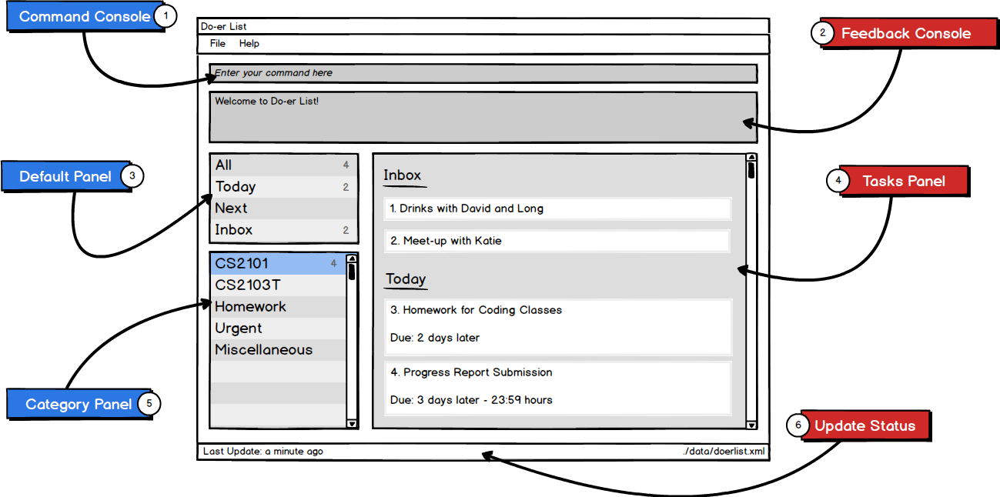
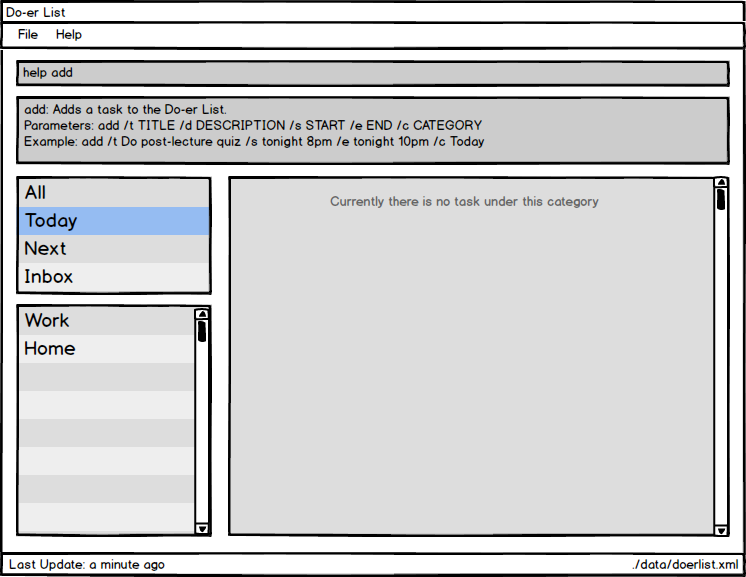
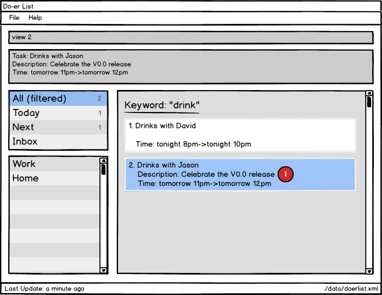
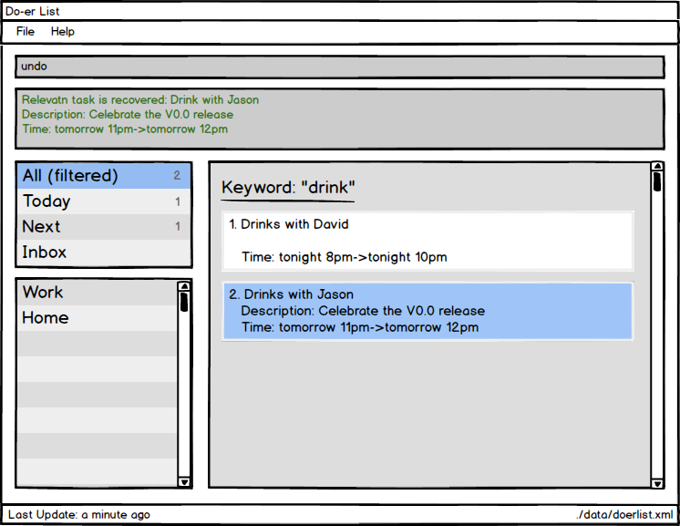
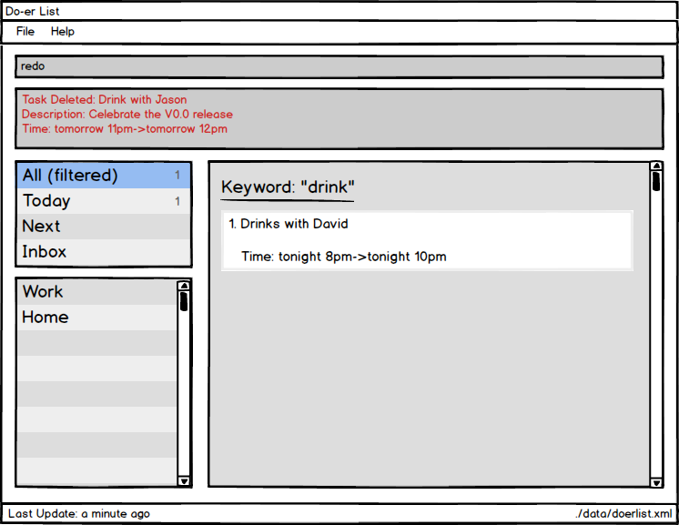

# User Guide

* [About Us](#about-us)
* [Overiew](#overview)
* [Getting Started](#getting-started)
* [Features](#features)
    * [Help](#viewing-help-:-`help`)
    * [Add task](#adding-a-task-:-`add`)
    * [Edit task](#editing-a-task-:-`edit`)
    * [Mark task](#mark-task-as-done-:-`mark`)
    * [Ummark task](#unmark-task-as-done-:-`unmark`)
    * [List task](#listing-tasks-in-a-certain-category-:-`list`)
    * [Find task](#finding-all-tasks-containing-any-keyword-in-their-name-:-`find`)
    * [View task](#view-a-task-:-`view`)
    * [Delete task](#deleting-a-task-:-`delete`)
    * [Undo](#undo-the-most-recent-operation-:-`undo`)
    * [Redo](#redo-the-most-recent-operation-:-`redo`)
    * [Taskdue](#find-all-tasks-due-:-`taskdue`)
    * [Exit](#exiting-the-program-:-`exit`)
    * [Saving the data](#saving-the-data)
* [FAQ](#faq)
* [Command Summary](#command-summary)

## About Us
Living in the modern and fast-paced world nowadays, we are constantly bombarded with tasks to do. Many people face the problem of time management as the traditional methods prove to be little effective. That is what Do-er List aims to solve.

Do-er List is a task manager that is designed for students and office workers. It is a beginner-friendly desktop program that aids you in the planning and completion of your daily tasks.  It does not matter if you are planning a big birthday surprise event or recurring task of handling the laundry every now and then, Do-er List is here to resolve your problems.

This user guide aims to allow any user to seamlessly use the product, as intended to. Just follow the instructions as stated and you will get the results you desire.

Eager and excited? Then proceed!   

[Back To Top](#user-guide)

## Overview

| Labels | Description |
|-------- | -------- |
|1 | Type your commands in the **Command Console** to execute the desired commands. |
|2 | **Feedback Console** shows if your command is executed properly or not. |
|3 | View your default categories in the **Default Panel**. |
|4 | **Tasks Panel** will display all the taks you listed in a panel. |
|5 | **Category Panel** shows all the custom categories that you have created. |
|6 | View your last update and file storage in **Update Status**.|

## Getting Started

Do-er List makes the process of adding, editing or deleting your tasks a seamless process. Long gone are the days when you have to type in long and complicated commands or endlessly mouse-click to get what you desire.

All commands have this standard format:

`Command required_fields [optional_fields]...`

All commands start with a command words, followed by fields that are replaced by your inputs. The fields in the square bracket "[" and "] are optional. You can choose to not include these fields.
 
*Please take note of the following:*

1. Ensure you have Java version `1.8.0_60` or later installed in your Computer. 
   > This app will not work with earlier versions of Java 8. 
   
2. Download the latest `doerlist.jar` from the [releases](../../../releases) tab.
3. Copy the file to the folder you want to use as the home folder for the Do-*er*List.
4. Double-click the file to start the app. The GUI should appear in a few seconds.  
 
5. Type the command in the command box and press <kbd>Enter</kbd> to execute it.
   *  e.g. typing **`help`** and pressing <kbd>Enter</kbd> will open the help window.
6. Some example commands you can try:
   * **`add`**` -t Do post-lecture quiz <today->tomorrow> -c CS2103` :
     adds a task called `Do post-lecture quiz` to the Do-*er*List that starts `today`
	 and ends` tomorrow` under the category `CS2103`.
	* **`list`**` CS2103` : lists all tasks in **CS2103**
   * **`delete`**` 1` : deletes the 1st task shown in the current list
   * **`exit`** : exits the application
7. Refer to the [Features](#features) section below for details of each command. 

[Back To Top](#user-guide)

## Features

> **Command Format**
> 
> * Words in `UPPER_CASE` are the parameters.
> * Items in `SQUARE_BRACKETS` are optional.
> * Items with `...` after them can have multiple instances.
> * If a command has multiple parameters, the order of parameters doesn't matter.

#### Viewing help : `help`
Format: `help` or `help [COMMAND_NAME]`

> If the `COMMAND_NAME` is supplied, it will display the instructions of using that command. 
> Help is also shown if you enter an incorrect command e.g. `abcd`

[Back To Top](#user-guide)

#### Adding a task : `add`
Adds a task to the Do-*er*List 
Format: `add /t TITLE [/d DESCRIPTION] [/s START] [/e END] [/c CATEGORY] ...`

> * A task can have any number of categories (including 0).
> * The START or END parameter can be in natural language*.
> * If the START date is missing, the Do*er*-List set it to today by default.
> * If there is no START or END parameters, the Do*er*-list will create task without start date and end date and move it to `Inbox` built-in category.
 
> * Supported list for natural language*:
>  * next X hours / days / weeks / months
>    * *X* can be any number: 1, 2, 3, ...
>  * today
>  * tomorrow
>  * next week / month

Examples: 

* `add /t Weekly Laundry /s 2016-11-23 21:00 /c Chores` 
* `add /t Daily Exercise and Workout!` 
* `add /t Call Mum in Hanoi /d Limit chat timing for overseas charges /s tomorrow 8pm /e tomorrow 10pm /c Optional`

[Back To Top](#user-guide)

#### Editing a task : `edit`
Edit an existing task in the Do-*er* List 
Format: `edit INDEX [/t TITLE] [/d DESCRIPTION] [/s START] [/e END] [/c CATEGORY]...`

> Edit an existing task by calling its index. The task's title, description, start date, end date and category can be edited.
  
Examples:

* `edit 2 /t Daily Laundry /c Chores /c Daily`
* `edit 3 /c Do Homework`
* `edit 3 /s tomorrow 23 00`

> Attributes that are not supplied will not be updated 

[Back To Top](#user-guide)

#### Mark task as done : `mark`
Marks a certain task as done in the Do*er*-list. 
Format: `mark TASK_NUMBER`

> Mark task `TASK_NUMBER` as done. The task must exist in the Do*er*-list.

Examples:

* `mark 5`
   Returns task number `5` as done.

[Back To Top](#user-guide)

#### Unmark task as done : `unmark`
Marks a certain task as undone in the Do*er*-list. 
Format: `unmark TASK_NUMBER`

> Mark task `TASK_NUMBER` as undone. The task must exist in the Do*er*-list.

Examples:

* `unmark 5`
   Returns task number `5` as undone.

[Back To Top](#user-guide)

#### Listing tasks in a certain category : `list`
Shows a list of all tasks in the Do*er*-list under the specific category. 
Format: `list [CATEGORY]` or `list [DATE]`

> * If the `CATEGORY` or `DATE` parameter is not supplied, then it will list all tasks.
> * Using `DATE` will display all the tasks that falls under the date, in natural language*.
 
> * Supported list for natural language*:
>  * next X hours / days / weeks / months
>    * *X* can be any number: 1, 2, 3, ...
>  * today
>  * tomorrow
>  * next week / month

Examples:

* `list`
* `list Work`
* `list 2016-10-13`
* `list Tomorrow`

[Back To Top](#user-guide)

#### Finding all tasks containing any keyword in their name : `find`
Finds tasks whose names contain any of the given keywords. 
Format: `find KEYWORD [MORE_KEYWORDS]`

> * The search is not case sensitive.
>   * `lecture` will match `LecTure`
> * The order of the keywords does not matter. 
>  * `go to lecture` will match `Lecture go to`
> * Title and Description is searched.
> * All data in the Do-*er*List matching at least one keyword will be returned 
    * `lecture` will match `have lecture`

Examples: 

* `find david` 
  Returns `Drinks with David `

[Back To Top](#user-guide)

#### View a task : `view`
Views the task identified by the index number used in the last task listing. 
Format: `view INDEX`

> * Views the details of the task at the specified `INDEX`. 
> * The index refers to the index number shown in the most recent listing. 
  The index **must be a positive integer** 1, 2, 3, ...

Examples: 

* `list` 
  `view 2` 
  Views the 2nd task in the Do*er*-list.
* `find David`   
  `view 1` 
  Views the 1st task in the results of the `find` command.

[Back To Top](#user-guide)

#### Deleting a task : `delete`
Deletes the specified task / event from the Do-*er*List. Irreversible. 
Format: `delete INDEX`

> * Deletes the task / event at the specified `INDEX`. 
> * The index refers to the index number shown in the most recent listing. 
  The index **must be a positive integer** 1, 2, 3, ...

Examples: 

* `list` 
  `delete 2` 
  Deletes the 2nd task / event in the Do-*er*List.  
  
* `find David`  
  `delete 1` 
  Deletes the 1st task / event in the results displayed by using the `find` command.

[Back To Top](#user-guide)

#### Undo the most recent operation : `undo`
Undo the most recent operation which modify the data in the Do*er*-list 
Format: `undo`

[Back To Top](#user-guide)

#### Redo the most recent operation : `redo`
Redo the most recent undo 
Format: `redo`

> An `undo` command must first be used before `redo` command can be executed.

[Back To Top](#user-guide)

#### Find all tasks due : `taskdue`
Finds all tasks due on and before the date specified in the Do*er*-list. 
Format: `taskdue END_DATE`

> * Finds all tasks due on and before `END_DATE`. 
> * The date can be in natural language*.
 
> * Supported list for natural language*:
>  * next X hours / days / weeks / months
>    * *X* can be any number: 1, 2, 3, ...
>  * today
>  * tomorrow
>  * next week / month
  
Examples:

* `taskdue tomorrow`
* `taskdue next 5 hours`
* `taskdue 2016-11-11 21:03`

[Back To Top](#user-guide)

#### Exiting the program : `exit`
Exits the program. 
Format: `exit`  

[Back To Top](#user-guide)

### Saving the data 
The Do*er*-list data are saved in the hard disk automatically after any command that changes the data. 

[Back To Top](#user-guide)

## FAQ

**Q**: How do I transfer my data to another computer? 
**A**: Install the app in the other computer and overwrite the empty data file it creates with the file that contains the data of your previous Do-*er* List folder.
 

**Q**: Running "doerlist.jar" gives and error or does not seem to work. 
**A**: You will need to install the latest version of Java. Refer to the installation guide [here](https://java.com/en/download/help/download_options.xml). 
 

**Q**: Where is the save button for me to save my schedule in this program?  
**A**: Your data are saved in the hard disk automatically after any command that changes the data as aforementioned [here](#saving-the-data) in the guide. There is no need for you to save it manually.

       
## Command Summary

Command | Format  
-------- | :-------- 
Help | `help [COMMAND]`
Add | `add /t TITLE [/d DESCRIPTION] [/s START] [/e END] [/c CATEGORY] ...`
Edit | `edit INDEX [/t TITLE] [/d DESCRIPTION] [/s START] [/e END] [/c CATEGORY] ...`
Mark Done | `mark TASK_NUMBER`
Mark Undone | `unmark TASK_NUMBER`
List | `list [CATEGORY]`
Find | `find KEYWORD [MORE_KEYWORDS]`
View | `view INDEX`
Delete | `delete INDEX`
Undo | `undo`
Redo | `redo`
Task Due | `taskdue END_DATE`
Exit | `exit`
