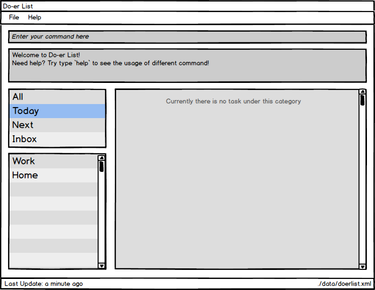
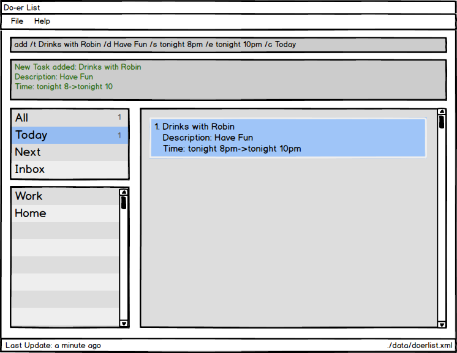
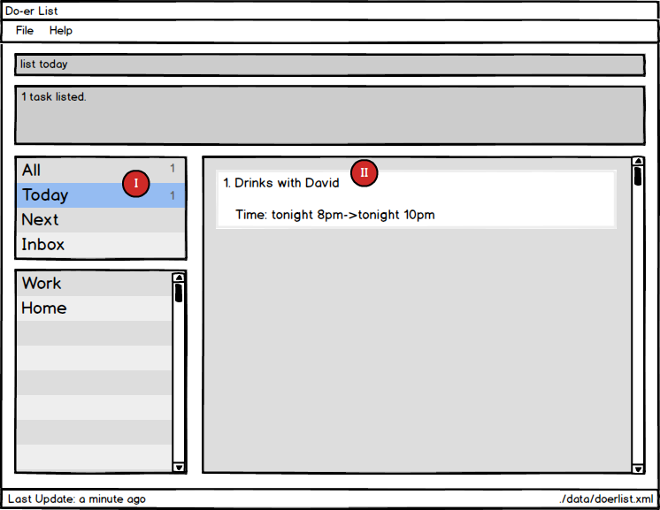
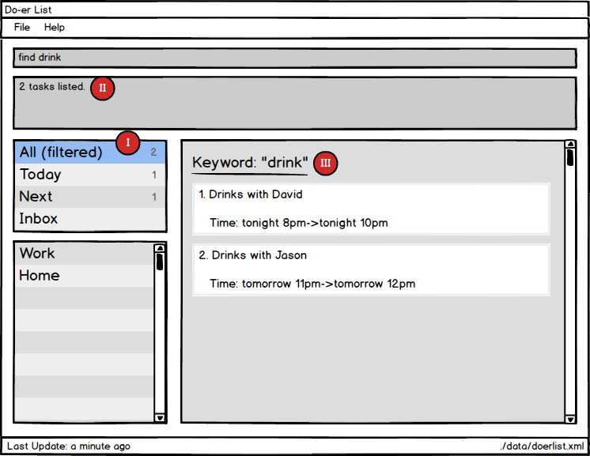
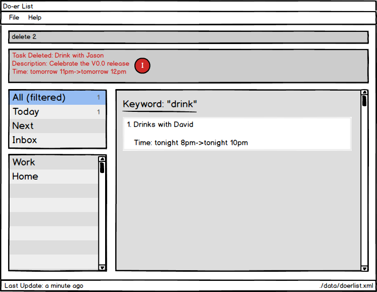
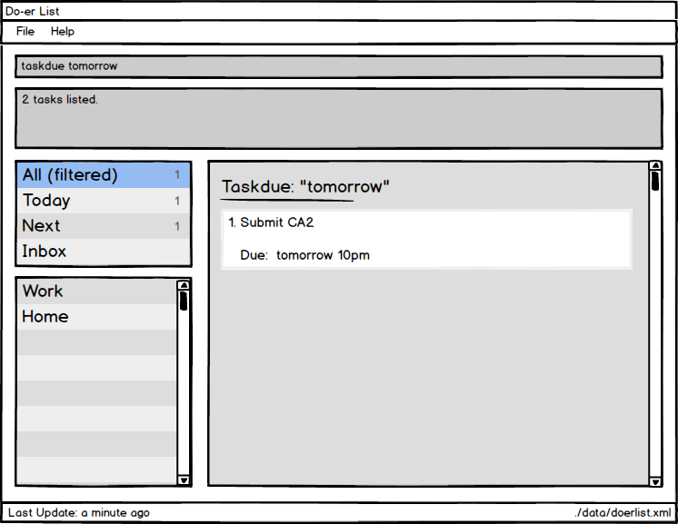

# User Guide

* [Quick Start](#quick-start)
* [Features](#features)
* [FAQ](#faq)
* [Command Summary](#command-summary)

## Quick Start

1. Ensure you have Java version `1.8.0_60` or later installed in your Computer. 
   > Having any Java 8 version is not enough.  
   This app will not work with earlier versions of Java 8.
   
2. Download the latest `doerlist.jar` from the [releases](../../../releases) tab.
3. Copy the file to the folder you want to use as the home folder for the Do-*er*List.
4. Double-click the file to start the app. The GUI should appear in a few seconds.  
5. Type the command in the command box and press <kbd>Enter</kbd> to execute it.  
   e.g. typing **`help`** and pressing <kbd>Enter</kbd> will open the help window. 
6. Some example commands you can try:
   * **`add`**` -t Do post-lecture quiz <today->tomorrow> -c CS2103` : 
     adds a task called `Do post-lecture quiz` to the Do-*er*List that starts `today`
	 and ends` tomorrow` under the category `CS2103`.
	* **`list`**` CS2103` : lists all tasks in **CS2103**
   * **`delete`**` 1` : deletes the 1st task shown in the current list
   * **`exit`** : exits the application
7. Refer to the [Features](#features) section below for details of each command. 

## Features

> **Command Format**
> * Words in `UPPER_CASE` are the parameters.
> * Items in `SQUARE_BRACKETS` are optional.
> * Items with `...` after them can have multiple instances.
> * If a command has multiple parameters, the order of parameters doesn't matter.

#### Viewing help : `help`
Format: `help` or `help [COMMAND_NAME]`

> If the `COMMAND_NAME` is supplied, it will display the instructions of using that command. 
> Help is also shown if you enter an incorrect command e.g. `abcd`
 
#### Adding a task / an event: `add`
Adds a task/event to the Do-*er*List 
Format: `add -t TITLE [-d DESCRIPTION] [{[START]->[END]}] [-c CATEGORY ...`

> * Task can have any number of categories (including 0)
> * The START or END parameter can be in natural language (next X hours, today, 
  tomorrow, next X days, next week, next month) or in standard format “2016-10-3 10:00”
> * If the START date is missing, the Do*er*-List set it to today by default.
> * If the there is not START->END parameters or END date is missing, the Do*er*-list will create task without start date and end date and move it to `Inbox` build-in category.

Examples: 

* `add -t Do post-lecture quiz {today->tomorrow} -c CS2103` 
* `add -t Do CA1 -d Oral Presentation {->next 2 days} -c CS2101` 
* `add {2016-10-4 10:00->2016-10-4 12:00} -t Take lecture -c CS2102`

#### Editing an event : `edit`
Edit an existing task / event in the Do-*er*List 
Format: `edit INDEX [-n TITLE] [-d DESCRIPTION] [{[START]->[END]}] [-c CATEGORY] ...`

> Edit an existing task by calling its index. The event's title, description, start date, end date and category can be edited.
  
Examples:

* `edit 1 -t Do ST2334 quiz -c ST2334`
* `edit 2 {->next 5 days}`

> Attributes that aren't supplied will not be updated 

#### Listing tasks in a certain category : `list`
Shows a list of all tasks in the Do*er*-list under the specific category. 
Format: `list [CATEGORY]`

> If the `CATEGORY` parameter is not supplied, then list all tasks.

Examples:

* `list`
* `list CS2101`

#### Finding all tasks / events containing any keyword in their name: `find`
Finds tasks / events whose names contain any of the given keywords. 
Format: `find KEYWORD [MORE_KEYWORDS]`

> * The search is not case sensitive. e.g `lecture` will match `LecTure`
> * The order of the keywords does not matter. e.g. `go to lecture` will match `Lecture go to`
> * Title and Description is searched.
> * All data in the Do-*er*List matching at least one keyword will be returned 
    (i.e. `OR` search).
    e.g. `lecture` will match `have lecture`

Examples: 

* `find david` 
  Returns `Drinks with David `

#### Deleting a task / an event : `delete`
Deletes the specified task / event from the Do-*er*List. Irreversible. 
Format: `delete INDEX`

> * Deletes the task / event at the specified `INDEX`. 
> * The index refers to the index number shown in the most recent listing. 
  The index **must be a positive integer** 1, 2, 3, ...

Examples: 

* `list` 
  `delete 2` 
  Deletes the 2nd task / event in the Do-*er*List.
* `find David`  
  `delete 1` 
  Deletes the 1st task / event in the results of the `find` command.

#### View a task : `view`
Views the task identified by the index number used in the last task listing. 
Format: `view INDEX`

> * Views the details of the task at the specified `INDEX`. 
> * The index refers to the index number shown in the most recent listing. 
  The index **must be a positive integer** 1, 2, 3, ...

Examples: 

* `list` 
  `view 2` 
  Views the 2nd task in the Do*er*-list.
* `find David`   
  `view 1` 
  Views the 1st task in the results of the `find` command.
  
#### Find all tasks due : `taskdue`
Finds all tasks due on and before the date specified in the Do*er*-list. 
Format: `taskdue END_DATE`

> Finds all tasks due on and before `END_DATE`. 
  The date can be in natural language
  (E.g. next X hours, today, tomorrow, next X days, next week, next month)
  or in standard format
  (E.g. 2016-10-3 10:00)
  
Examples:

* `taskdue tomorrow`

#### Undo the most recent operation : `undo`
Undo the most recent operation which modify the data in the Do*er*-list 
Format: `undo`

#### Redo the most recent operation : `redo`
Redo the most recent undo 
Format: `redo`

#### Mark task as done : `mark`
Marks a certain task as done in the Do*er*-list. 
Format: `mark TASK_NUMBER`

> Mark task `TASK_NUMBER` as done. The task must exist in the Do*er*-list.

Examples:

* `mark 5`
   Returns task number `5` as done.

#### Unmark task as done : `unmark`
Marks a certain task as undone in the Do*er*-list. 
Format: `unmark TASK_NUMBER`

> Mark task `TASK_NUMBER` as undone. The task must exist in the Do*er*-list.

Examples:

* `unmark 5`
   Returns task number `5` as undone.

#### Clearing all entries : `clear`
Clears all entries from the address book. 
Format: `clear`  

#### Exiting the program : `exit`
Exits the program. 
Format: `exit`  

#### Saving the data 
The Do*er*-list data are saved in the hard disk automatically after any command that changes the data. 
There is no need to save manually.

#### View events in Google Calendar

A build-in browser is embedded inside the browser. Once authorized, it will automatically sync events 
with Google Calendar and should the UI of Google Calendar.

## FAQ

**Q**: How do I transfer my data to another Computer? 
**A**: Install the app in the other computer and overwrite the empty data file it creates with 
       the file that contains the data of your previous Do-*er*List folder.
       
## Command Summary

Command | Format  
-------- | :-------- 
Add | `add -t TITLE [-d DESCRIPTION] [{[START]->[END]}] [-c CATEGORY] ...`
Edit | `edit INDEX [-t TITLE] [-d DESCRIPTION] [{[START]->[END]}] [-c CATEGORY] ...`
Delete | `delete INDEX`
View | `view INDEX`
Find | `find KEYWORD [MORE_KEYWORDS]`
List | `list [CATEGORY]`
Help | `help [COMMAND]`
Task Due | `taskdue END_DATE`
Undo | `undo`
Redo | `redo`
Mark Done | `mark TASK_NUMBER`
Mark Undone | `unmark TASK_NUMBER`
Clear | `clear`
